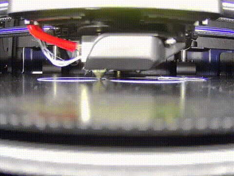

# 3dp_timelapse

## concept
  * Capturing with simple operations
  * Capturing with USB camera
  * Encode mp4 with simple operation
  * Can be operated using a smartphone browser

## Operating environment (operation has been confirmed)
* server
  * Ubuntu18.04 or later
  * Raspberry Pi OS Buster or later
    * Raspberry Pi 3b+ or 4
* client
  * google chrome for windows
  * google chrome for android

## Setup environmen
* add video group permission  
(reconnect the terminal to reflect the settings)
```
$  sudo gpasswd -a $USER video
```
* install python environment
```
$ cd 3dp_timelapse/web_app
$ sudo apt install python3-pip
$ pip3 install -r requirements.txt
```

* install ffmpeg environment
```
$ sudo apt install ffmpeg
```

* setup crontab (optional)
  * If you want to start the Flask server at the same time as the PC starts
```
$ crontab -e
```
write this definition and save
```
@reboot cd (full path of 3dp_timelapse)/web_app && bash (full path of 3dp_timelapse)/web_app/server_run.sh
```

## How to use
* TODO
