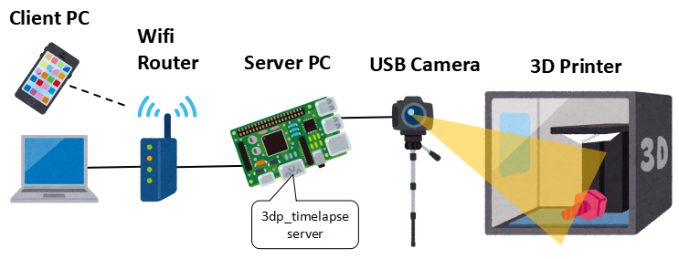

# 3dp_timelapse


---


---

## Overview
  * Capturing with simple operations
  * Capturing with USB camera
  * Encoding mp4 with simple operation
  * Can be operated using a smartphone browser

## Operating environment (operation has been confirmed)
* Server
  * Ubuntu18.04 or later
  * Raspberry Pi OS Buster or later
    * Raspberry Pi 3b+ or 4
* Client
  * google chrome for windows
  * google chrome for android

## Setup environment
### add video group permission  
(reconnect the terminal to reflect the settings)
```
$  sudo gpasswd -a $USER video
```
### install python environment
```
$ cd 3dp_timelapse/web_app
$ sudo apt install python3-pip
$ pip3 install -r requirements.txt
```

### install ffmpeg environment
```
$ sudo apt install ffmpeg
```

### setup crontab
  * If you want to start the Flask server at the same time as the PC starts
```
$ crontab -e
```
write this definition and save
```
@reboot cd (full path of 3dp_timelapse)/web_app && bash (full path of 3dp_timelapse)/web_app/server_run.sh
```

### Connect USB camera
* display usb device
* 3dp_timelapse uses `/dev/video0` by default
```
$ ls /dev/video*
/dev/video0  /dev/video1
```
  * How to see the resolutions and formats supported by the camera
  * 3dp_timelapse uses 1280x720 30fps MJPG by default
```
$ sudo apt install v4l-utils
$ v4l2-ctl --list-formats-ext
```

### Check ip address
* take notes ip address of inet
```
$ ip a
    ...
    inet 192.168.xxx.xxx
```

## How to use
* see wiki page
  * https://github.com/rsna6ce/3dp_timelapse/wiki/how_to_use
